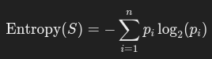
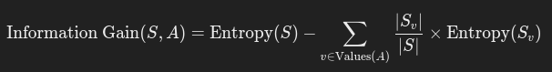

# Random Forest

## Principle

### Bootstrapping
- Extract a subset from original data to form new dataset

### Random Feature Selection
- Extract a random attribute from subset to use as a split

### Entropy

- Uncertainty in a dataset
- − i=1∑n ​pi​log2​(pi​)
- 0 -> Single class, no uncertainty
- 1 -> Equal distribution of class, max certainty
- Random forest creates classifier to reduce entropy

### Information Gain

- Reduction of entropy after a split by attribute
- Quantifies how well an attribute separates a class

## Parameters

### Number of Estimators
- Number of trees in a forest
- Usually 100 to 500

### Maximum Depth
- Maximum depth of each tree
- Helps control overfitting

### Minimum Sample Splitted
- Minimum number of samples required to split a node
- Higher value prevents overfitting but require more data

### Minimum Sample Leafs
- Minimum number of samples required at a leaf node
- Higher value is more robust
- Prevent very specific splits that captures noise

### Maximum Features
- Number of features to consider for best split
- Can be fraction, log, square root

### Bootstrap
Whether bootstrap is enabled

### Criterion
- Function used to measure the quality of a split
- Like a loss function
- Gini for Gini Impurity
- Entropy for information gain in classification

### Max Samples
- Maximum number of original dataset used to build each tree

### Out-of-bag Score
- Enables out of bag samples to be used for estimating accuracy

## Training

## Classification
