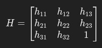
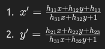
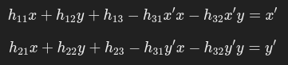
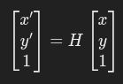

# Perspective Transform

## Transformation Matrix



### Projecting Points Calculation
Assume we want a card sized object, horizontally, max 640x480 frame size

85.60mm x 59.38mm -> 1.44:1

Top-left, clockwise

| Source Plane | Destination Plane |
|----------|----------|
|   (x1, y1)  |   (0, 0)  |
|   (x2, y2)  |   (640, 0)  |
|   (x3, y3)  |   (640, 444)  |
|   (x4, y4)  |   (0, 444)  |

### Calculating Transformation Matrix





### Performing Transformation

For each point in the destination MAT, use the following equation



Since the frame size is 640x444, we can do

```python
import cv2
import numpy as np

for y in range(444):
    for x in range(640):
        # dest_mat[y][x] = H dot source_mat[y][x]
```

## OpenCV

OpenCV provides a shorthand to perform perspective transform

### getPerspectiveTransform

```python
import cv2
import numpy as np

# Define the points in the source image
src_points = np.float32([[0, 0], [width, 0], [width, height], [0, height]])

# Define the points in the destination image
dst_points = np.float32([[10, 100], [200, 50], [220, 200], [20, 250]])

# Compute the perspective transformation matrix
M = cv2.getPerspectiveTransform(src_points, dst_points)
```

### warpPerspectiveTransform

```python
# Apply the perspective transformation to the image
output_image = cv2.warpPerspective(input_image, M, (width, height))
```
